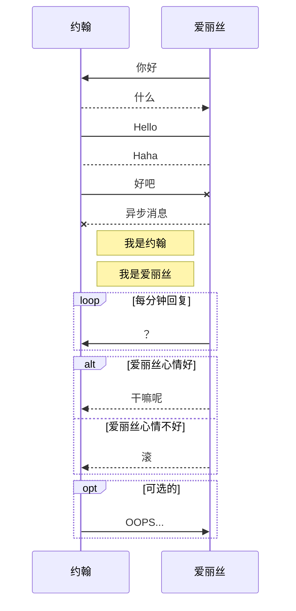

```mermaid
sequenceDiagram
    participant 约翰
    participant 爱丽丝
    爱丽丝->>约翰: 你好
    约翰-->>爱丽丝: 什么
    爱丽丝->约翰: Hello
    爱丽丝-->约翰: Haha
    约翰-x爱丽丝: 好吧
    爱丽丝--x约翰: 异步消息
    Note right of 约翰: 我是约翰
   	Note left of 爱丽丝: 我是爱丽丝
    loop 每分钟回复
    	爱丽丝->>约翰: ？
    end
    alt 爱丽丝心情好
    	爱丽丝-->>约翰: 干嘛呢
    else 爱丽丝心情不好
    	爱丽丝-->>约翰: 滚
    end
    opt 可选的
    	约翰->>爱丽丝: OOPS...
    end
```

- TB - top bottom
- BT - bottom top
- RL - right left
- LR - left right
- TD - same as TB

```mermaid
graph TD


```

```mermaid
%% LEFT->RIGHT
graph LR

```