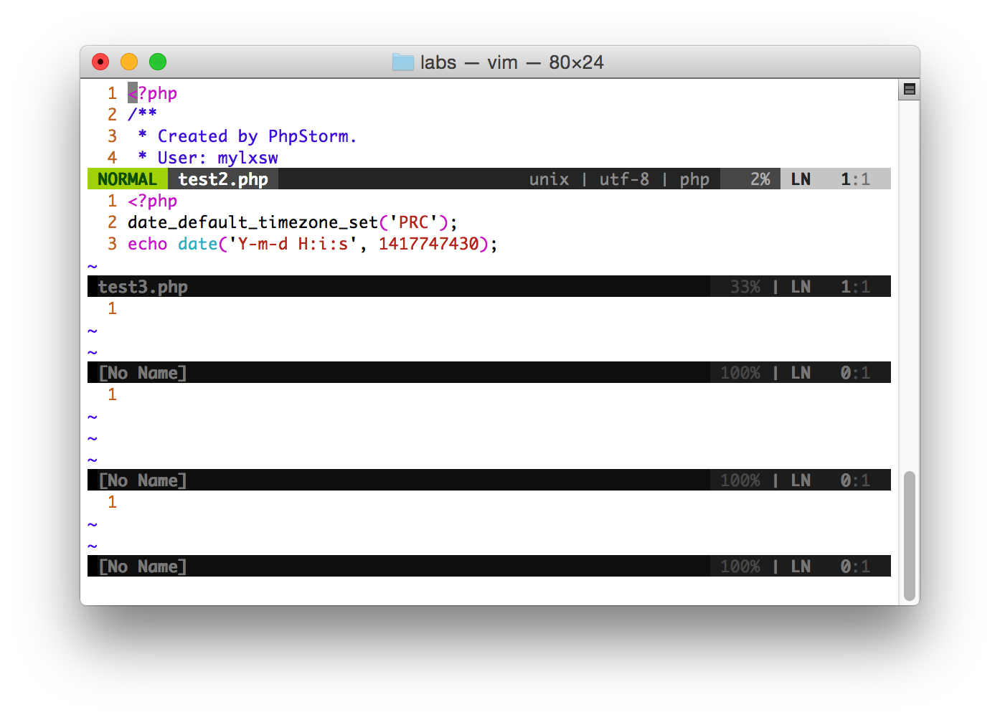

###Vim学习笔记

####使用vim打开多个文件

```bash
vim -o file1 file2
```

使用`-o`选项可以指定开始的时候将窗口分割成多少份，比如下列命令：
```bash
vim -o5 file1 file2
```

上述命令将窗口分割成5份，每份相同大小。



> 在vim中要分割窗口的话，可以使用`:split`和`:vsplit`命令。

```
:[n]split [++opt] [+cmd] [file]
```

- **n** 指定了新打开的窗口中，顶部的窗口占用多少行。
- **opt** 指定了传递给新打开窗口的参数，注意这些参数要以`++`开头。
- **cmd** 给新窗口传递需要执行的命令，注意这里的命令以单个`+`开头。
- **file** 指定新开窗口中需要编辑的文件。

####常用命令

- 在窗格间切换的方法

		Ctrl+w+方向键——切换到前／下／上／后一个窗格
		Ctrl+w+h/j/k/l ——同上
		Ctrl+ww——依次向后切换到下一个窗格中
